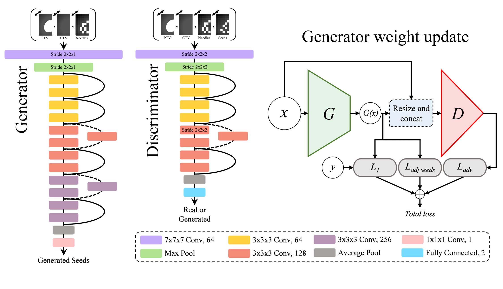

# Rapid Treatment Planning for Low-dose-rate Prostate Brachytherapy with TP-GAN

Keras/Tensorflow implementation of TP-GAN for automating treatment planning for low-dose-rate prostate brachytherapy. This work has been published in Medical Image Computing and Computer Assisted Intervention – MICCAI 2021 (https://miccai2021.org/en/).

<a href="https://link.springer.com/chapter/10.1007%2F978-3-030-87202-1_56" target="_blank">Paper |</a>
<a href="" target="_blank" rel="noopener noreferrer">Presentation</a>

<p align="left">
<a href="#"></a>
</p>

### Dependencies
```
Python 3.6
Tensorflow: 2.0.0
Keras: 2.3.1
```

### Environment Setup

Recreate conda environment as follows:
```
conda env create -f environment.yml
```

Or if you are using Docker:
```
docker pull tazleef/tf2.0.0-cv-keras2.3.1-imgaug:latest
```

### Training

Due to privacy policy, we are unable to share our clinical dataset. However, we have included a few sample cases for reference. Format your centre's dataset in the same way and set the filepath and training parameters in `train.py`. 

To train the model, run `train.py`. 

The model for automatic needle plan generation from target volumes can be found [here](https://github.com/tajwarabraraleef/3Dpix2pix-for-prostate-brachytherapy). Using these two techniques together will allow for an end-to-end treatment planning solution for prostate brachytherapy.  

This code can be used for other 3D image to image translation task by modifying the network architectures accordingly. 

### Citation

Please cite the following paper if you use this code in your work:
```
@InProceedings{aleef2021,
title={Rapid Treatment Planning for Low-dose-rate Prostate Brachytherapy with TP-GAN},
author={Aleef, Tajwar Abrar, Spadinger, Ingrid T., Peacock, Michael D., Salcudean, Septimiu E. and Mahdavi, S. Sara},
booktitle="Medical Image Computing and Computer Assisted Intervention -- MICCAI 2021",
pages={581--590},
year={2021},
organization={Springer}
}
```

### Contact 

If you face any problem using this code then please create an issue in this repository or contact me at [tajwaraleef@ece.ubc.ca](mailto:tajwaraleef@ece.ubc.ca?subject=[GitHub]%20TP-GAN%20Issue%20)

### Acknowledgements

The 3D Resnet code is based on [https://github.com/JihongJu/keras-resnet3d](https://github.com/JihongJu/keras-resnet3d)

### License
MIT

